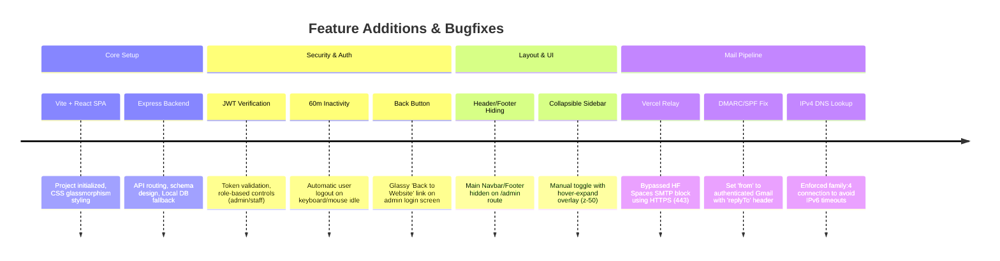

# Embed AIoT Monorepo & System Architecture

Welcome to the **Embed AIoT** monorepo! This repository merges the high-end React-based company website (Frontend) and the Node.js/Express REST API (Backend). It is engineered for seamless scalability, local testability, and administrative control.

---

## 🗺️ System Architecture & Mail Pipeline

```mermaid
graph TD
    subgraph Frontend [Vite + React Host: Vercel]
        SPA["React SPA (Client App)"]
        Relay["Serverless HTTPS Relay (/api/send-email)"]
    end
    subgraph Backend [Express Host: Hugging Face Spaces]
        API["Node.js REST API"]
        Db["MongoDB Atlas (Cloud DB)"]
    end
    subgraph Mail [SMTP Delivery]
        Gmail["Gmail SMTP Server"]
    end

    SPA -->|API Requests| API
    API -->|HTTPS Request (Secure Key)| Relay
    Relay -->|SMTP Secure SSL| Gmail
    API -->|Mongoose DB Operations| Db
```

---

## 📅 Visual Development Roadmap & History

Below is a detailed log of all milestones, features added, bugs resolved, and structural enhancements.



### Bugfix & Modification History

| Component | Issue | Root Cause | Resolution |
| :--- | :--- | :--- | :--- |
| **Email Submissions** | Emails not delivered to `embedaiot@gmail.com` | Hugging Face Spaces block direct SMTP outbound ports (25/465/587). | Developed an HTTPS-based serverless email relay in `frontend/api/send-email.js` on Vercel. The backend fetches this relay securely. |
| **SPF/DMARC Rejection** | Messages from strict domains (e.g. `@seecs.edu.pk`) discarded. | Direct sender spoofing (`from: visitor@example.com`) violates SPF/DMARC rules. | Set authenticated address `embedaiot@gmail.com` as the sender. Placed visitor's email in `replyTo` so replies work. |
| **IPv6 Timeout** | Backend email dispatch hangs / fails with `ENETUNREACH`. | Node 17+ defaults to IPv6, which is unsupported/unrouted on Hugging Face container grids. | Programmed a custom dns `lookup` function in Nodemailer to force IPv4 (`family: 4`) resolution. |
| **Vercel Routing** | Reloading `/admin` returned Vercel `404 Not Found`. | Vercel SPA router did not know how to handle direct page requests. | Added `vercel.json` rewrite configuration at the project root to route page requests to `/index.html`. |
| **Admin Navbar Clipping** | Site navbar blocked dashboard statistics and footer overlapped sidebar. | Admin page was wrapped inside the global `MainLayout` layout container. | Modified `MainLayout.jsx` with `useLocation` to dynamically hide global navbar, footer, and whatsapp button on `/admin`. |
| **Collapsible Sidebar** | Sidebar took up too much screen space. | Fixed width `w-64` was hardcoded. | Refactored sidebar to manually collapse (`w-16`). Added transition animations and `onMouseEnter` to auto-expand to `w-64` on hover. |

---

## 🛠️ Local Installation & Development

To launch both the frontend and backend servers concurrently:

1. **Install dependencies** in both workspaces:
   ```bash
   npm run install-all
   ```
2. **Start development servers**:
   ```bash
   npm run dev
   ```
   * **Frontend Client**: `http://localhost:5173/`
   * **Backend API**: `http://localhost:5000/`

---

## ⚙️ Active Environment Details (Secrets & URLs)

Use this directory to restore active state in future chat sessions:

* **Production URL (Frontend)**: `https://embedaiot81.vercel.app`
* **Production API (Backend)**: `https://embedaiot-embedaiot-api.hf.space`
* **Health API Endpoint**: `https://embedaiot-embedaiot-api.hf.space/api/health`
* **MongoDB Connection URI**: *[Configured via MONGODB_URI secret in HF Space settings]*
* **Hugging Face Hub API Token**: *[Refer to local deploy_backend.py or keyring]*
* **Admin Access Credentials**:
  * **Email**: `admin@embedaiot.com`
  * **Password**: `admin12345`
* **Monitoring**: **Uptime Robot** actively checks `https://embedaiot81.vercel.app` and `https://embedaiot-embedaiot-api.hf.space/api/health` to prevent backend sleeping.

---

## 🚀 Operations & Maintenance Guide (Step-by-Step)

Follow these steps exactly when updating the codebase, deploying changes, or checking server health:

### Step 1: Synchronize Git Codebases
Make sure changes are committed and pushed to both the spec/staging repo and the user's primary repo:
```bash
# Add files and commit
git add .
git commit -m "Your detailed commit message"

# Push to primary user repo
git push original main

# Push to staging spec repo
git push origin main
```

### Step 2: Deploy Frontend Updates to Vercel
Vercel automatically triggers deployments upon git pushes. To trigger a manual production deployment:
1. Navigate to the root directory.
2. Run the deployment command:
   ```bash
   npx vercel --prod --yes
   ```
3. Ensure the environment secrets (`EMAIL_RELAY_SECRET`, `EMAIL_USER`, `EMAIL_PASS`) are updated in Vercel settings if credentials change.

### Step 3: Deploy Backend Updates to Hugging Face
The backend runs on a Hugging Face Space. Run the helper python script to package and upload changes:
1. Verify python dependency is active: `pip install huggingface_hub`.
2. Run the upload script:
   ```bash
   python deploy_backend.py
   ```
3. If database credentials change, run:
   ```bash
   python update_space_secrets.py
   ```
4. To check live Hugging Face Space application logs and save them locally, run:
   ```bash
   python get_space_logs.py
   ```

### Step 4: Verify Uptime & Health
To ensure the Hugging Face Space does not enter "sleeping" status:
1. Access the Uptime Robot dashboard.
2. Confirm two active monitors:
   * **Frontend Monitor**: HTTP(s) ping to `https://embedaiot81.vercel.app` (5-minute interval).
   * **Backend Monitor**: HTTP(s) ping to `https://embedaiot-embedaiot-api.hf.space/api/health` (5-minute interval).
3. If the backend returns `503` or fails, run `python get_space_logs.py` to diagnose.

---

## 🔑 Permissions & Roles Overview

* **Admin Role**: Full control over content categories (portfolio, service, product, team, story) + Staff account creation/deletion.
* **Staff Role**: Full content authoring permissions, but cannot view, edit, or delete other Staff profiles.
