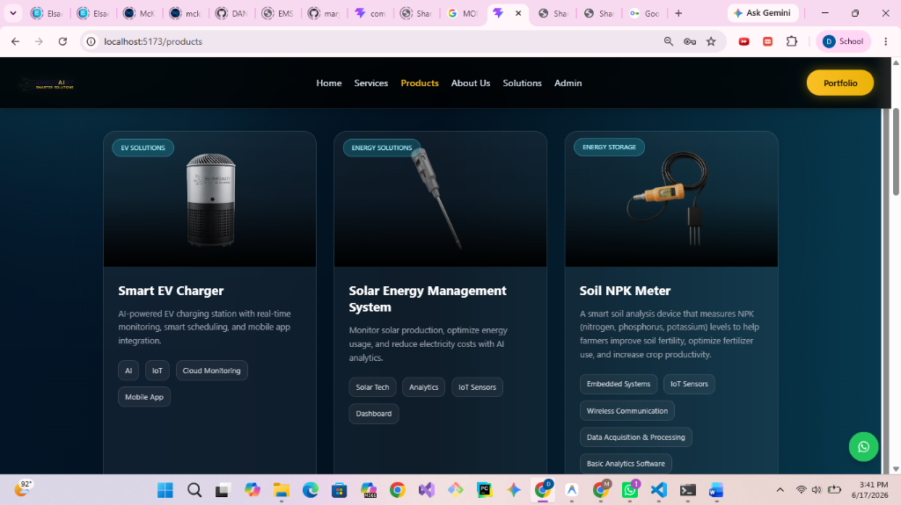
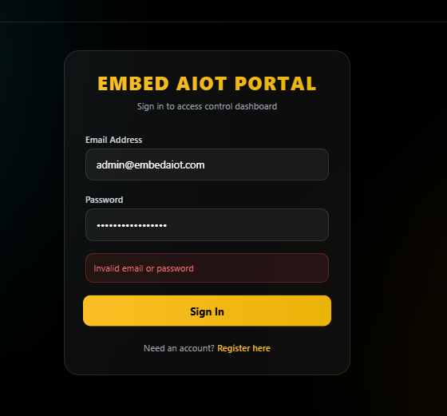
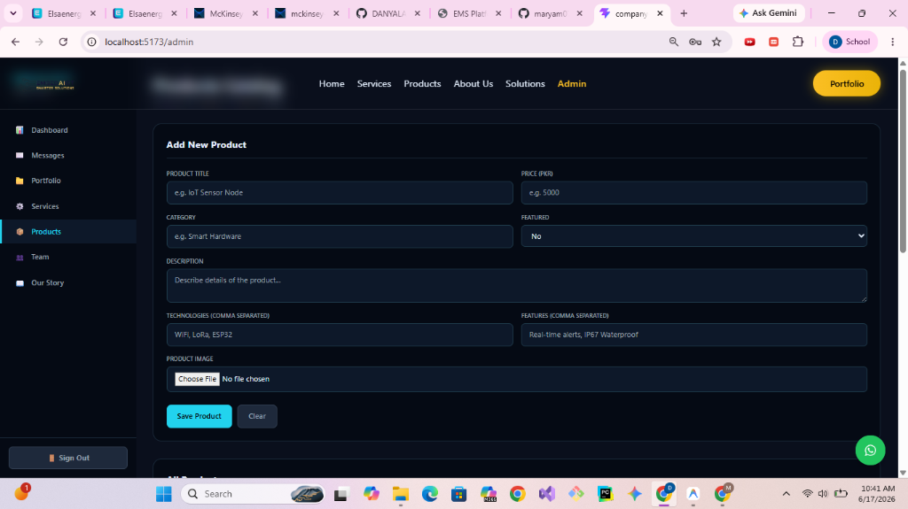
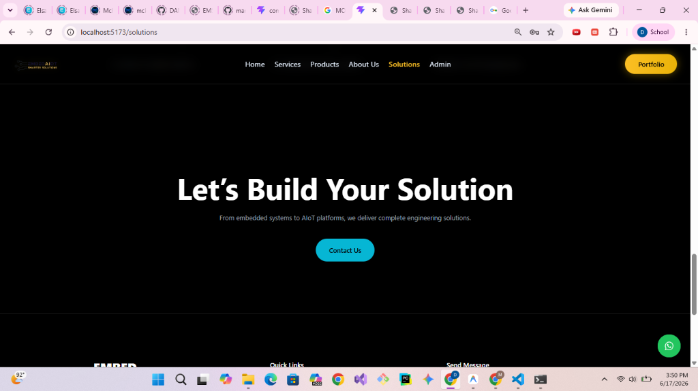
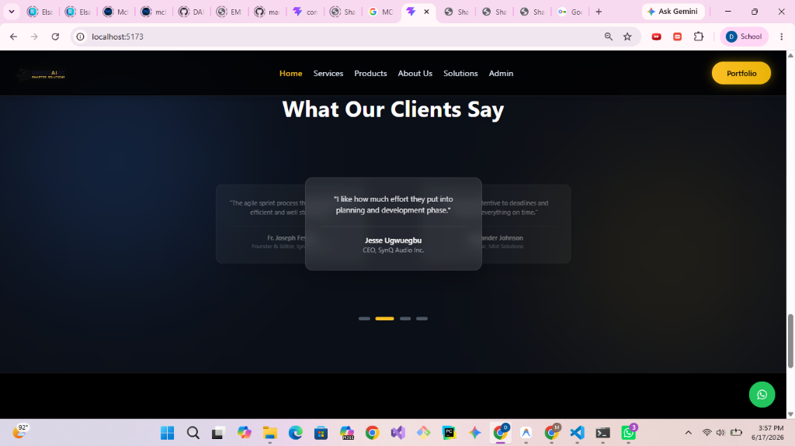
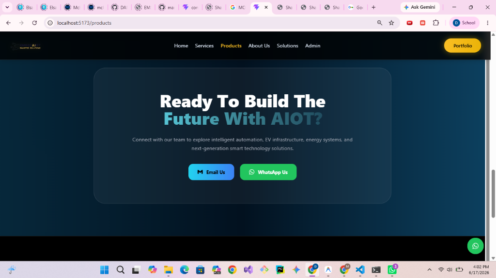

# Embed AIoT Monorepo

Welcome to the **Embed AIoT** repository! This is a unified, production-ready monorepo combining the high-end React-based company website (Frontend) and the robust Node.js/Express REST API (Backend). It is engineered for seamless scalability, local testability out-of-the-box, and administrative security.

---

## 🚀 Key Features

### Frontend (Vite + React)
- **High-End Aesthetics**: Dark-mode primary design featuring glassmorphism, glowing micro-interactions, smooth CSS/Framer Motion transitions, and fully responsive layouts.
- **Dynamic Content Injection**: Fetches portfolios, services, team members, and stories dynamically from backend APIs, with graceful static fallbacks if the API is offline.
- **Embedded Admin Portal**: Secure, React-based control panel built directly into the navbar `/admin` path for managing all website content.
- **Role-Based Access Control (RBAC)**: Distinguishes between `admin` (full user & content control) and `staff` (read/write content, no user management) access levels.
- **Session Auto-Sign Out**: Automatically logs out users after 60 minutes of inactivity (tracking keyboard, mouse, scroll, and touch events) to secure sessions.

### Backend (Node.js + Express)
- **Zero-Config Dev Fallback**: Connects to MongoDB Atlas in production, and automatically boots a local in-memory MongoDB server (`mongodb-memory-server`) in development if no connection string is provided.
- **Nodemailer console logging**: Prints sent email contact details directly to the console if SMTP credentials are not configured in development, keeping testing functional.
- **Token-Based Authentication**: Secure JSON Web Token (JWT) verification for dashboard endpoints.
- **Seeded Master Admin**: Automatically authenticates master administrative logins using hardcoded fallback credentials (`admin@embedaiot.com` / `admin12345`) if the database is unseeded.

---

## 📁 Project Structure

```
website-embedaiot/
├── backend/                  # Node.js + Express Server
│   ├── config/               # DB Connection & env configurations
│   ├── controllers/          # Request handlers (products, admin, contact)
│   ├── middleware/           # Auth token validator
│   ├── models/               # Mongoose DB Schemas (Product, Service, Team)
│   ├── routes/               # API Router setup
│   └── server.js             # Main server entrypoint
├── frontend/                 # Vite + React Client
│   ├── src/
│   │   ├── components/       # Reusable layout & sections (Navbar, Footer)
│   │   ├── data/             # Static fallback catalog (products.js, portfolioData.js)
│   │   ├── pages/            # Page components (AdminPortal, Solutions, ProductsPage)
│   │   ├── config.js         # API base endpoint config
│   │   ├── App.jsx           # Routing & App entry
│   │   └── main.jsx          # DOM entry
└── README.md                 # Project Documentation
```

---

## 🛠️ Local Installation & Development

To launch both the frontend and backend servers concurrently with a single command:

1. **Clone the repository** (if not already local)
2. **Install all dependencies** from the root folder:
   ```bash
   npm run install-all
   ```
3. **Start the development servers**:
   ```bash
   npm run dev
   ```
   - **Frontend** will be running at `http://localhost:5173/`
   - **Backend** API will be running at `http://localhost:5000/`

---

## ⚙️ Configuration (.env)

The servers are configured to run with default fallback values out-of-the-box, but you can customize settings using local environment files:

### Backend Configuration (`backend/.env`)
Create a `.env` file in the `backend/` folder:
```env
PORT=5000
MONGODB_URI=your_mongodb_connection_string
JWT_SECRET=your_jwt_signing_secret
EMAIL_USER=your_smtp_email
EMAIL_PASS=your_smtp_password
```

### Frontend Configuration (`frontend/.env`)
Create a `.env` file in the `frontend/` folder:
```env
VITE_API_URL=http://localhost:5000
```

---

## 🔑 Administrative Access

To access the control panel, go to the **Admin** link in the navbar or navigate directly to `http://localhost:5173/admin`:

- **Master Credentials**:
  - **Email**: `admin@embedaiot.com`
  - **Password**: `admin12345`
- **Role Permissions**:
  - **Admin**: Can create/delete staff accounts via the `Staff & Admins` tab, view submitted inbox messages, and add/edit/delete all website content.
  - **Staff**: Can read/write portfolio projects, services, products, team profiles, and stories, but does not have user management privileges.

---

## 🖼️ Application Visuals & Walkthroughs

Below is a look at the web application and its control panel in action:

### 1. Products & Solutions Catalog
The website dynamically displays products like the Air Purifier, Soil Moisture Meter, and Soil NPK Meter, customized to the company's brand styling.


---

### 2. Admin Portal - Login
Secure authentication interface for admins and staff members.


---

### 3. Admin Portal - Dashboard & Stats
Overview panel showcasing website statistics (total projects, products, services, and inbox messages) with quick-access action shortcuts.


---

### 4. Admin Portal - Products Manager
Content creation and upload tools for managing items in the dynamic catalog.


---

### 5. Admin Portal - Staff & User Accounts Management
Available only to users with the `admin` role to add and delete portal accounts.


---

### 6. Interactive Contact Forms
Floating communication widgets (WhatsApp button) and inline contact forms configured to route directly to SMTP email or console logging fallbacks.


---

## 📝 License
This project is licensed under the MIT License - see the LICENSE file for details.
